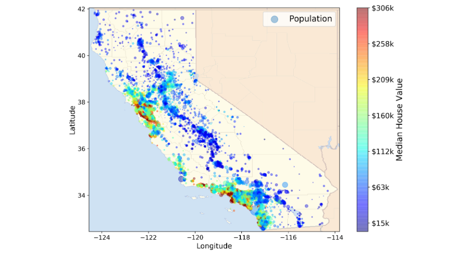

# California-House-Price-Prediction

Overview
--------
This is a guided project from the book "Hands-On Machine Learning with Scikit-Learn, Keras, and TensorFlow, 2nd Edition" by Aurelien Geron. This is my first ever end-to-end machine learning project, where I discovered the Data Science project life cycle and awesome Scikit-Learn tools for Machine Learning. This end-to-end project involves understanding the business problem, gathering data, Exploratory Data Analysis, preparing the data for machine learning algorithms using pipelines, model training and evaluation using cross-validation, Fine-tuning models with GridSearchCV and a brief about presenting solution, launching, monitoring and maintaining the system.

Table of Contents
-----------------
1. Primary Objective
2. Results
3. Credits
4. Contact

Primary Objective
-----------------
The objective of this project is to develop a machine learning model that can accurately predict the median housing price of districts in California using various metrics, including population, median income, and other relevant factors. The data provided includes sample data for each block group, which is the smallest geographical unit published by the US Census Bureau and typically has a population of 600 to 3000 people. The model's main focus is to predict the median housing price of a district based on the given metrics.

Results
-------
RMSE was used as performance measure and Random Forest Regressor performed better than other models with an error of 48053 on the test
set and 18693 on the train set after first round of hyperparameter tuning. Even though the model is likely overfitting on the training data, the project provided a good guideline for carrying out Data Science and Machine Learning projects independently.

Credits
-------
- Data was collected programmatically using https://raw.githubusercontent.com/ageron/handson-ml2/master/datasets/housing/housing.tgz
- This project is based on 2nd chapter in the book "Hands-On Machine Learning with Scikit-Learn, Keras, and TensorFlow, 2nd Edition" by Aurelien Geron. Please visit the author's repository by following the [link](https://github.com/ageron/handson-ml2).

Contact
-------
- **Name**: Shreyas
- **Email**: shreyasdb99@gmail.com
- **GitHub**: [shre-db](https://github.com/shre-db)
- **Instagram**: [shryzium](https://www.instagram.com/shryzium/)

